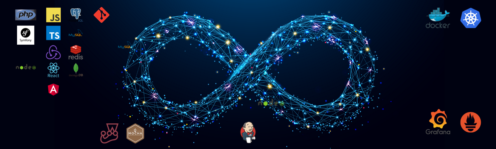

## 👨🏻‍💻  About Me
----
💡  I like to explore new technologies and develop software solutions..\
📠 I am in continuous learning. Always looking for new technologies to learn.\
🌱  I am on my way to learn more about blockchain technologies, devOps and cloud architecture..\
📷  In my spare time, I dedicate myself to photography, playing squash and sailing.\
💬  Feel free to reach out to me for pro bono consulting and volunteering, or just for some interesting discussion.\
✉️  You can shoot me an email at martin.a.chaparro@gmail.com! I'll try to respond as soon as I can.

   

## 🛠 &nbsp;Tech Stack
----
<table><tr><td valign="top" width="33%">

### Frontend  

  
  
  
  
  
  
  
  
  
  
  
  

</td><td valign="top" width="33%">

### Backend  

  
  
  
  
  
  
  
  
  
  
  
  
  
    
  
  
  
  

</td><td valign="top" width="33%">

### DevOps  

  
  
  
  
   
  
  
  

</td></tr></table>  

   

## 📈 &nbsp;GitHub Analytics
----
 

 

## 📻 &nbsp;My Spotify
----
   

 

## 🤝🏻 &nbsp;Connect with Me
---

